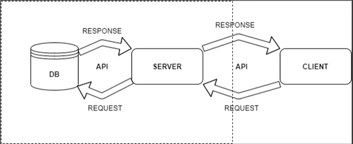

# Digital library (Web application written in python with deployments in AWS)

### Stack : 
- python + django
- postgres
- aws

### The architecture of the project is as follows:

The user sends a request to the server, followed by the request and the database, and then the response is returned
to the user.

## Project Description:

The project consists of a server part with a database connection and further deployment to the AWS.

When entering the electronic library, the user can have 2 roles:
* guest
* authorized user

As a guest, the user can make requests for information about the book, author, genre and search for what he needs.

As an authorized user, he has all the actions of a guest, as well as (adding, deleting, downloading a book, online reading).

### Database includes user data, books, authors

The guest can only make GET requests:  
* GET /books/ - here we get a list of books  
* GET /books/byAuthor - get books by a specific author

An authorized user can make various kinds of requests:

* GET /books/ - get all books  
* POST /books/authorName/bookName - adding a book  
* DELETE /books/authorName/bookName - deleting a book  

